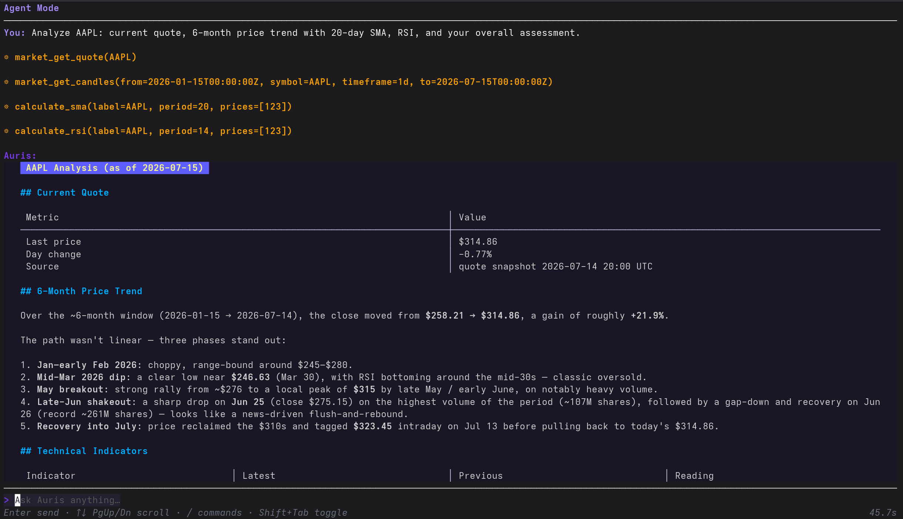
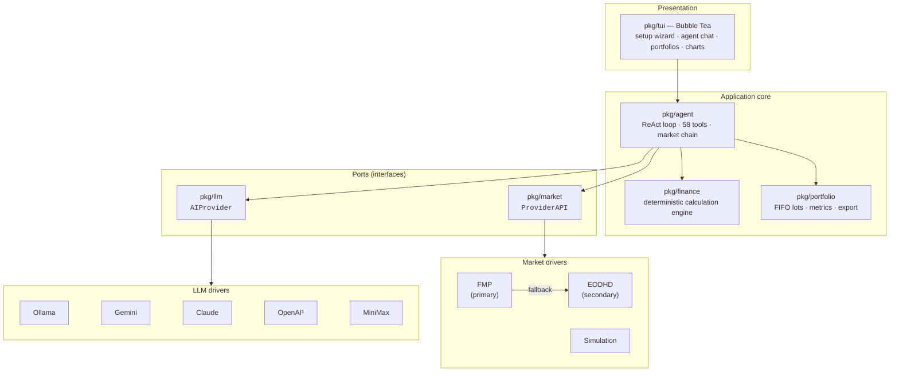

# Auris

[](https://github.com/fuchicar/auris-ai/actions/workflows/ci.yml)
[](https://go.dev)
[](LICENSE)

> 🇪🇸 [Leer en castellano](README_ES.md)
> 📖 [Full documentation & guides on the Wiki](https://github.com/fuchicar/auris-ai/wiki)

**Auris** is a terminal-based AI financial advisor. It combines real-time market data with conversational AI so you can analyse instruments, run financial calculations, and manage portfolios — entirely from your terminal.



## Table of contents

- [Overview](#overview)
- [Documentation](#documentation)
- [Main features](#main-features)
- [Architecture](#architecture)
- [Technology stack](#technology-stack)
- [Project structure](#project-structure)
- [Installation](#installation)
- [Running Auris](#running-auris)
- [Providers](#providers)
- [Testing & quality](#testing--quality)
- [License](#license)

## Overview

Auris is a conversational agent for retail investors and finance enthusiasts who live in the terminal. You ask questions in natural language — *"How volatile has AAPL been over the last six months compared to MSFT?"* — and the agent answers by orchestrating **58 tools** over live market data, a deterministic financial calculation engine, and your own portfolios.

Three design principles drive the project:

1. **The LLM never does arithmetic.** Every number — ROI, Sharpe ratio, VaR, DCF, Monte Carlo paths — is computed by a pure Go calculation engine (`pkg/finance`) with strictly validated inputs. The model decides *what* to compute; the code decides the *result*. This eliminates numeric hallucination in the domain where it matters most.
2. **Every external service is a swappable driver.** LLM backends and market data providers implement narrow interfaces behind a registry, so adding a provider never touches the core (see [Architecture](#architecture)).
3. **Local-first and private by default.** Auris runs as a single static binary, supports fully local inference via Ollama, and encrypts credentials — and optionally portfolios and chat history — at rest with Argon2id + AES-256-GCM.

> **Disclaimer:** Auris is a decision-support and educational tool, not regulated financial advice. The application shows this disclaimer on first run.
> See [AI Disclaimer & Responsible Use](https://github.com/fuchicar/auris-ai/wiki/AI-Disclaimer-and-Responsible-Use) on the wiki for the full explanation, with good/bad practice examples.

## Documentation

This README covers the essentials. The [wiki](https://github.com/fuchicar/auris-ai/wiki) goes deeper on each topic, in English:

| Page | What you'll find there |
|---|---|
| 🚀 [Using the Agent](https://github.com/fuchicar/auris-ai/wiki/Using-the-Agent) | First steps, the setup wizard, recommended first prompts, and a full portfolio-creation walkthrough. |
| ⚠️ [AI Disclaimer & Responsible Use](https://github.com/fuchicar/auris-ai/wiki/AI-Disclaimer-and-Responsible-Use) | What Auris's numbers can and can't responsibly be used for, with good/bad practice examples. |
| ❓ [FAQ & Troubleshooting](https://github.com/fuchicar/auris-ai/wiki/FAQ-and-Troubleshooting) | Common questions, provider errors, and what to do when something looks stuck. |
| 🤝 [Contributing](https://github.com/fuchicar/auris-ai/wiki/Contributing) | Fork, branch, commit convention, local checks, and how to open a PR. |
| 🛠️ [Building from Source](https://github.com/fuchicar/auris-ai/wiki/Building-from-Source) | Requirements, `go build`, Nix, running the test suite, and how releases are built. |
| 🏛️ [Architecture & Design Decisions](https://github.com/fuchicar/auris-ai/wiki/Architecture-and-Design-Decisions) | The ports & adapters shape of the codebase and the reasoning behind ten key design decisions. |
| 🔒 [Security & Privacy](https://github.com/fuchicar/auris-ai/wiki/Security-and-Privacy) | Exactly how credentials, portfolios, and sessions are encrypted at rest, and what that protects against (and what it doesn't). |
| 🗺️ [Roadmap & Future Work](https://github.com/fuchicar/auris-ai/wiki/Roadmap-and-Future-Work) | What's shipped, what's genuinely still open, and what's aspirational. |

## Main features

### 🤖 AI agent
- Interactive chat driven by a **ReAct loop** (up to 10 reasoning/tool iterations per turn) with **58 tools**: 21 financial calculations, 16 portfolio operations, 10 market data, 6 technical indicators, 3 time, 1 news, 1 currency conversion.
- **6 LLM backends**: Ollama (local), Google Gemini, Anthropic Claude, OpenAI, MiniMax, and any OpenAI-compatible endpoint (DeepSeek, Groq, OpenRouter, self-hosted proxies…).
- Responses personalised by a 10-question financial profile (risk tolerance, horizon, goals).
- **Capability filtering**: tools a provider can never serve are removed from the LLM's tool list up front, so the model never wastes an iteration on a call that cannot succeed.

### 📈 Market data
- Real-time quotes, historical candles, fundamentals, corporate actions, and instrument search across stocks, ETFs, forex, futures, and crypto.
- Two providers combined in a **fallback cascade**: Financial Modeling Prep (primary, US coverage) → EODHD (secondary, adds non-US exchanges such as BME/Madrid).
- **Simulation mode**: fully synthetic data driver — try every feature without signing up for any API key.

### 🧮 Financial engine
- **Valuation**: ROI, CAGR, P&L, DCF, multiples, P/FCF, PEG, dividend yield & growth.
- **Risk**: volatility, Sharpe, Sortino, max drawdown, beta, Treynor, information ratio, VaR.
- **Technical indicators**: SMA, EMA, RSI, MACD, Bollinger Bands, correlation matrix — rendered as charts in the terminal.
- **Simulation**: Monte Carlo (up to 100,000 paths), stress testing, compound interest, currency conversion.

### 💼 Portfolio management
- Multiple portfolios with **FIFO lot tracking** and 6 transaction types (buy, sell, dividend, deposit, withdrawal, adjustment).
- Realised/unrealised P&L, allocation analysis, concentration (HHI), rebalancing suggestions, and benchmark comparison (alpha/beta).
- Watchlists, and export to JSON (full fidelity, re-importable) plus CSV (positions, lots, metrics).

### 🔒 Security
- API keys encrypted at rest with **AES-256-GCM**, key derived from your passphrase via **Argon2id** (64 MiB memory cost).
- Optional encryption of portfolios and chat sessions with the same scheme — enabled by default for new setups, toggleable at any time with transparent re-encryption of existing files.
- Atomic file writes protect all persisted state against corruption.

### 🖥️ Experience
- Full TUI built with Bubble Tea: guided setup wizard, agent chat with markdown rendering, portfolio dashboards, terminal charts.
- Persistent conversation sessions.
- English and Spanish UI, auto-detected from the system locale.
- 6 themes (light/dark variants).
- Financial news aggregation from configurable RSS/Atom feeds.

## Architecture

Auris follows a **ports & adapters** (hexagonal) architecture. The two core domains — market data and AI inference — are defined as small interfaces ("ports") in `pkg/market` and `pkg/llm`; each concrete provider is an isolated driver package ("adapter") in `pkg/drivers/`, wired up through a static registry.



¹ The OpenAI driver also serves any OpenAI-compatible endpoint, registered as a separate provider entry.

Key decisions (full rationale in the [Architecture Decision Records](docs/adr.md)):

- **Driver pattern with static registry.** `pkg/registry` holds the ordered list of all providers. Adding a provider means implementing one interface in a new package and adding one registry entry — the agent, TUI, and config layers are untouched.
- **Fallback cascade with sentinel errors.** All drivers wrap a shared set of sentinel errors (`ErrNotFound`, `ErrRateLimit`, `ErrSubscriptionRequired`, …) with `%w`. The market chain tries providers in priority order and falls through **only** on errors that mean "this provider can't answer" — an authentication failure surfaces immediately instead of being masked by a fallback.
- **Capability reporting.** Drivers statically declare agent tools they can never fulfil (e.g. order-book data on REST-only providers); the agent filters those out of the LLM's tool list. The chain excludes a tool only if *every* provider in it lacks the capability.
- **Validated numeric boundaries.** Every numeric parameter entering `pkg/finance` is validated by domain-specific helpers (price vs. return vs. annualised rate) before any computation, so LLM-supplied arguments can never produce NaN/Inf garbage.
- **Reproducible releases.** GoReleaser builds cross-platform binaries on tag push; dev builds fall back to Go's VCS stamping so `auris -version` is always truthful.

## Technology stack

| Category | Technology | Why |
|---|---|---|
| Language | [Go 1.25](https://go.dev) | Single static binary, `CGO_ENABLED=0`, trivial cross-compilation for Linux/macOS/FreeBSD |
| TUI framework | [Bubble Tea](https://github.com/charmbracelet/bubbletea) + Bubbles + [Lip Gloss](https://github.com/charmbracelet/lipgloss) | Elm-architecture TUI: predictable state, testable screens |
| Rendering | [Glamour](https://github.com/charmbracelet/glamour) · [ntcharts](https://github.com/NimbleMarkets/ntcharts) | Markdown rendering and charts inside the terminal |
| AI SDKs | [anthropic-sdk-go](https://github.com/anthropics/anthropic-sdk-go) · [openai-go](https://github.com/openai/openai-go) · [google.golang.org/genai](https://pkg.go.dev/google.golang.org/genai) | Official SDKs; Ollama and MiniMax via their REST APIs |
| Market data | [FMP](https://financialmodelingprep.com) · [EODHD](https://eodhd.com) REST APIs | Consumed with `net/http` only — no heavyweight client dependencies |
| Cryptography | [golang.org/x/crypto](https://pkg.go.dev/golang.org/x/crypto) (Argon2id) + stdlib AES-GCM | Modern KDF, authenticated encryption |
| i18n | [go-i18n/v2](https://github.com/nicksnyder/go-i18n) | Locale-aware message catalogs (en/es) |
| News | [gofeed](https://github.com/mmcdole/gofeed) | RSS/Atom parsing |
| CI / Release | [GitHub Actions](.github/workflows) + [GoReleaser](https://goreleaser.com) | Build/vet/test on every push; cross-platform release archives on tag |
| Packaging | [Nix](https://nixos.org) (`shell.nix`, `default.nix`) | Reproducible dev environment and package build |

## Project structure

```
auris-ai/
├── cmd/auris/            # Entry point, flags, version stamping
├── pkg/
│   ├── agent/            # Agentic core: ReAct loop, 58 tool schemas & dispatch, market chain
│   ├── config/           # Encrypted config (Argon2id + AES-GCM), sessions, atomic persistence
│   ├── drivers/          # One package per external provider (adapters)
│   │   ├── anthropic/    #   LLM: Anthropic Claude
│   │   ├── eodhd/        #   Market: EOD Historical Data
│   │   ├── fmp/          #   Market: Financial Modeling Prep
│   │   ├── gemini/       #   LLM: Google Gemini
│   │   ├── minimax/      #   LLM: MiniMax
│   │   ├── ollama/       #   LLM: Ollama (local inference)
│   │   ├── openai/       #   LLM: OpenAI + OpenAI-compatible endpoints
│   │   └── simulation/   #   Market: synthetic data (no API key needed)
│   ├── finance/          # Pure calculation engine: valuation, risk, indicators, simulation
│   ├── llm/              # Port: AIProvider interface, shared LLM types, sentinel errors
│   ├── locale/           # i18n message catalogs (en/es)
│   ├── market/           # Port: ProviderAPI interface, market types, sentinel errors
│   ├── news/             # RSS/Atom feed aggregation, filtering, digest
│   ├── portfolio/        # Portfolios: FIFO lots, transactions, metrics, tax, export
│   ├── registry/         # Static registration of all market & LLM providers
│   └── tui/              # Bubble Tea UI: setup wizard, agent chat, portfolio screens
└── docs/                  # Architecture Decision Records (adr.md) and assets
```

## Installation

### Requirements

| Dependency | Notes |
|---|---|
| Go ≥ 1.25 | Only for building from source |
| Market data | An [FMP](https://financialmodelingprep.com) API key (free tier works), optionally an [EODHD](https://eodhd.com) key — or none at all in simulation mode |
| LLM | A local [Ollama](https://ollama.com) instance, or an API key for Gemini / Claude / OpenAI / MiniMax / any OpenAI-compatible endpoint |

### Build from source

```bash
git clone https://github.com/fuchicar/auris-ai.git
cd auris-ai
go build -o auris ./cmd/auris
./auris
```

Or install straight into your `$GOPATH/bin`:

```bash
go install github.com/fuchicar/auris-ai/cmd/auris@latest
```

### Prebuilt binaries

Tagged releases (`vX.Y.Z`) publish prebuilt Linux and macOS binaries (amd64/arm64), plus FreeBSD (amd64), on [GitHub Releases](https://github.com/fuchicar/auris-ai/releases), built with GoReleaser. Run `auris -version` to check what a given binary was built from.

### Nix & NixOS

The repository ships a `shell.nix` (dev environment: `go`, `gopls`, `golangci-lint`, `gotools`, `git`) and a `default.nix` (reproducible package build).

```bash
nix-shell        # development shell (or `direnv allow` if you use direnv)
nix-build        # build → ./result/bin/auris
nix-env -if .    # install into your user profile (uninstall: nix-env -e auris)
```

To add Auris to a NixOS or [home-manager](https://github.com/nix-community/home-manager) configuration, import the derivation directly:

```nix
{ config, pkgs, ... }:
let
  auris = pkgs.callPackage (builtins.fetchGit {
    url = "https://github.com/fuchicar/auris-ai.git";
    ref = "main";
  } + "/default.nix") {};
in {
  environment.systemPackages = [ auris ];   # NixOS
  # home.packages = [ auris ];              # home-manager
}
```

Classic Nix resolves nixpkgs from your system channel; to pin a version for fully reproducible builds, use a pinfile or migrate to a `flake.nix` (both `.nix` files are designed to be importable from a flake without duplication).

## Running Auris

### First run

On first launch, Auris runs a guided setup wizard:

1. **Language** — auto-detected; prompted if ambiguous
2. **Theme** — 6 light/dark variants
3. **Passphrase** — used to encrypt your API keys (and optionally portfolios/sessions) at rest
4. **Financial profile** — 10 questions that personalise the AI's advice
5. **Data mode** — real market data (API keys) or **simulation mode** (synthetic data, no signup)
6. **Market providers** — FMP API key, optionally EODHD as fallback
7. **AI providers** — select one or more (Ollama, Gemini, Claude, OpenAI, MiniMax, OpenAI-compatible) and configure each
8. **Default model** — the provider/model pair used by default in chat

On subsequent launches, you are only asked for your passphrase to unlock the configuration.

> New to Auris? [Using the Agent](https://github.com/fuchicar/auris-ai/wiki/Using-the-Agent) on the wiki has recommended first prompts and a full portfolio-creation walkthrough.

### Flags

```
auris [flags]

Flags:
  -setup          Force the setup wizard, even if a config already exists
  -debug <path>   Append agent diagnostic logs to the given file
  -version        Print version information and exit
```

### Environment variables

| Variable | Default | Description |
|---|---|---|
| `AURIS_OLLAMA_NUM_CTX` | `32768` | Context window size sent to Ollama. Increase for large models (e.g. `131072`). |
| `OPENAI_BASE_URL` | — | Fallback base URL for the OpenAI provider when not set in the config. |
| `OPENAI_API_KEY` | — | Fallback API key for the OpenAI provider when not set in the config. |
| `LC_ALL` / `LANG` | system | Determines the UI language (`en` or `es`). |

### Configuration file location

| Platform | Path |
|---|---|
| Linux | `~/.config/auris/auris.json` |
| macOS | `~/Library/Application Support/auris/auris.json` |

API keys are always encrypted at rest. Conversation history lives in a `sessions/` subdirectory alongside the config file; portfolios and sessions are additionally encrypted when storage encryption is enabled (the default for new setups).

## Providers

### LLM providers

| Provider | Notes |
|---|---|
| **Ollama** | Local inference. Default endpoint: `http://localhost:11434`. Supports custom base URL and API key for remote instances. |
| **Google Gemini** | Requires a Gemini API key. |
| **Anthropic Claude** | Requires an Anthropic API key. Supports custom base URL. |
| **OpenAI** | Requires an OpenAI API key. Falls back to `OPENAI_BASE_URL`/`OPENAI_API_KEY` when unset in the config. |
| **MiniMax** | Requires a MiniMax API key. |
| **OpenAI-Compatible** | Any third-party endpoint speaking the OpenAI API (DeepSeek, Groq, OpenRouter, self-hosted proxies…). Base URL configured in the wizard, independent of the plain OpenAI entry. |

### Market data providers

| Provider | Notes |
|---|---|
| **Financial Modeling Prep** | Primary provider. Free or paid API key; free tier covers most features (mainly US coverage). |
| **EOD Historical Data (EODHD)** | Optional fallback in the cascade; adds non-US coverage (e.g. BME/Madrid). |
| **Simulation** | Synthetic data, no API key. Selected via the wizard's data-mode step — ideal for demos and evaluation. |

## Testing & quality

- **740 test functions** across all packages (175 in the calculation engine alone), run on every push/PR by the [CI workflow](.github/workflows/ci.yml) (`go build` / `go vet` / `go test`).
- Tests are **hermetic by default**: driver suites run against `httptest` servers with no network or credentials. Live integration tests skip automatically when credentials are absent; the EODHD live suite is additionally opt-in behind a build tag to respect free-tier quotas.

```bash
go build ./...                  # build all packages
go vet ./...                    # static analysis
go test ./... -timeout 120s     # full test suite

# Live EODHD integration tests (opt-in)
go test -tags=integration ./pkg/drivers/eodhd/... -run TestLive
```

Integration test credentials are read from files in each driver's `test_data/` directory (see `CLAUDE.md` for details).

## License

[MIT](LICENSE) © Rafael Fernández

## Acknowledgements

This project was developed with AI coding assistance from multiple models, including Claude Sonnet 4.6, Claude Sonnet 5, Claude Opus 4.6, Claude Opus 4.7, Fable 5, Gemini Pro 3.1, and MiniMax M3. Specific per-commit attribution is not preserved — AI assistance was used for code review, refactoring, documentation, and test generation. All architectural decisions, implementation choices, and final code authorship remain with the human contributor.
