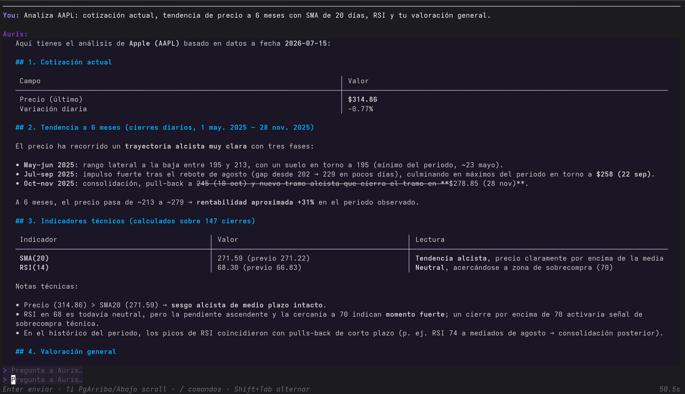
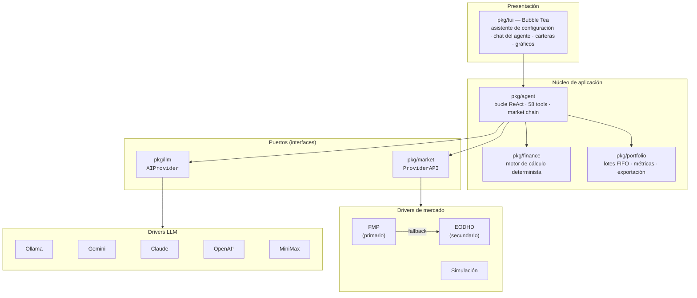

# Auris

[](https://github.com/fuchicar/auris-ai/actions/workflows/ci.yml)
[](https://go.dev)
[](LICENSE)

> 🇬🇧 [Read in English](README.md)
> 📖 [Documentación completa y guías en la Wiki](https://github.com/fuchicar/auris-ai/wiki) (en inglés)

**Auris** es un asesor financiero con IA para la terminal. Combina datos de mercado en tiempo real con IA conversacional para que puedas analizar instrumentos, ejecutar cálculos financieros y gestionar carteras — todo desde tu terminal.



## Índice

- [Descripción general](#descripción-general)
- [Documentación](#documentación)
- [Funcionalidades principales](#funcionalidades-principales)
- [Arquitectura](#arquitectura)
- [Stack tecnológico](#stack-tecnológico)
- [Estructura del proyecto](#estructura-del-proyecto)
- [Instalación](#instalación)
- [Ejecución](#ejecución)
- [Proveedores](#proveedores)
- [Testing y calidad](#testing-y-calidad)
- [Licencia](#licencia)

## Descripción general

Auris es un agente conversacional para inversores minoristas y aficionados a las finanzas que viven en la terminal. Haces preguntas en lenguaje natural — *"¿Qué volatilidad ha tenido AAPL en los últimos seis meses comparada con MSFT?"* — y el agente responde orquestando **58 tools** sobre datos de mercado en vivo, un motor de cálculo financiero determinista y tus propias carteras.

Tres principios de diseño guían el proyecto:

1. **El LLM nunca hace aritmética.** Cada número — ROI, ratio de Sharpe, VaR, DCF, trayectorias de Monte Carlo — lo calcula un motor de cálculo en Go puro (`pkg/finance`) con entradas estrictamente validadas. El modelo decide *qué* calcular; el código decide el *resultado*. Esto elimina la alucinación numérica justo en el dominio donde más importa.
2. **Cada servicio externo es un driver intercambiable.** Los backends LLM y los proveedores de datos de mercado implementan interfaces estrechas detrás de un registro, de forma que añadir un proveedor nunca toca el núcleo (ver [Arquitectura](#arquitectura)).
3. **Local primero y privado por defecto.** Auris se ejecuta como un único binario estático, admite inferencia totalmente local vía Ollama y cifra las credenciales — y opcionalmente carteras e historial de chat — en disco con Argon2id + AES-256-GCM.

> **Aviso:** Auris es una herramienta educativa y de apoyo a la decisión, no asesoramiento financiero regulado. La aplicación muestra este aviso en el primer arranque.
> Consulta [AI Disclaimer & Responsible Use](https://github.com/fuchicar/auris-ai/wiki/AI-Disclaimer-and-Responsible-Use) en la wiki (en inglés) para la explicación completa, con ejemplos de buenas y malas prácticas.

## Documentación

Este README cubre lo esencial. La [wiki](https://github.com/fuchicar/auris-ai/wiki) (en inglés) profundiza en cada tema:

| Página | Qué encontrarás |
|---|---|
| 🚀 [Using the Agent](https://github.com/fuchicar/auris-ai/wiki/Using-the-Agent) | Primeros pasos, el asistente de configuración, prompts recomendados y un recorrido completo de creación de carteras. |
| ⚠️ [AI Disclaimer & Responsible Use](https://github.com/fuchicar/auris-ai/wiki/AI-Disclaimer-and-Responsible-Use) | Para qué pueden usarse responsablemente los números de Auris y para qué no, con ejemplos de buenas y malas prácticas. |
| ❓ [FAQ & Troubleshooting](https://github.com/fuchicar/auris-ai/wiki/FAQ-and-Troubleshooting) | Preguntas frecuentes, errores de los proveedores y qué hacer si algo parece bloqueado. |
| 🤝 [Contributing](https://github.com/fuchicar/auris-ai/wiki/Contributing) | Fork, ramas, convención de commits, comprobaciones locales y cómo abrir una PR. |
| 🛠️ [Building from Source](https://github.com/fuchicar/auris-ai/wiki/Building-from-Source) | Requisitos, `go build`, Nix, ejecución de la suite de tests y cómo se generan los releases. |
| 🏛️ [Architecture & Design Decisions](https://github.com/fuchicar/auris-ai/wiki/Architecture-and-Design-Decisions) | La forma de puertos y adaptadores del código y el razonamiento tras diez decisiones de diseño clave. |
| 🔒 [Security & Privacy](https://github.com/fuchicar/auris-ai/wiki/Security-and-Privacy) | Cómo se cifran exactamente credenciales, carteras y sesiones en disco, y qué protege eso (y qué no). |
| 🗺️ [Roadmap & Future Work](https://github.com/fuchicar/auris-ai/wiki/Roadmap-and-Future-Work) | Qué está implementado, qué queda genuinamente pendiente y qué es aspiracional. |

## Funcionalidades principales

### 🤖 Agente IA
- Chat interactivo dirigido por un **bucle ReAct** (hasta 10 iteraciones de razonamiento/tools por turno) con **58 tools**: 21 de cálculo financiero, 16 de operaciones de cartera, 10 de datos de mercado, 6 de indicadores técnicos, 3 de tiempo, 1 de noticias y 1 de conversión de divisas.
- **6 backends LLM**: Ollama (local), Google Gemini, Anthropic Claude, OpenAI, MiniMax y cualquier endpoint compatible con OpenAI (DeepSeek, Groq, OpenRouter, proxies autoalojados…).
- Respuestas personalizadas mediante un perfil financiero de 10 preguntas (tolerancia al riesgo, horizonte, objetivos).
- **Filtrado por capacidades**: los tools que un proveedor nunca puede atender se eliminan de antemano de la lista del LLM, de modo que el modelo nunca desperdicia una iteración en una llamada que no puede funcionar.

### 📈 Datos de mercado
- Cotizaciones en tiempo real, velas históricas, fundamentales, acciones corporativas y búsqueda de instrumentos entre acciones, ETFs, forex, futuros y criptomonedas.
- Dos proveedores combinados en una **cascada con fallback**: Financial Modeling Prep (primario, cobertura US) → EODHD (secundario, añade bolsas no-US como BME/Madrid).
- **Modo simulación**: driver de datos totalmente sintéticos — prueba todas las funcionalidades sin darte de alta en ninguna API.

### 🧮 Motor financiero
- **Valoración**: ROI, CAGR, P&L, DCF, múltiplos, P/FCF, PEG, rentabilidad y crecimiento del dividendo.
- **Riesgo**: volatilidad, Sharpe, Sortino, max drawdown, beta, Treynor, information ratio, VaR.
- **Indicadores técnicos**: SMA, EMA, RSI, MACD, bandas de Bollinger, matriz de correlación — renderizados como gráficos en la terminal.
- **Simulación**: Monte Carlo (hasta 100.000 trayectorias), stress testing, interés compuesto, conversión de divisas.

### 💼 Gestión de carteras
- Múltiples carteras con **seguimiento de lotes FIFO** y 6 tipos de transacción (compra, venta, dividendo, depósito, retirada, ajuste).
- P&L realizado/no realizado, análisis de asignación, concentración (HHI), sugerencias de rebalanceo y comparación contra benchmark (alpha/beta).
- Watchlists y exportación a JSON (fidelidad completa, reimportable) más CSV (posiciones, lotes, métricas).

### 🔒 Seguridad
- Claves API cifradas en disco con **AES-256-GCM**, con clave derivada de tu contraseña mediante **Argon2id** (coste de memoria de 64 MiB).
- Cifrado opcional de carteras y sesiones de chat con el mismo esquema — activado por defecto en instalaciones nuevas, conmutable en cualquier momento con re-cifrado transparente de los ficheros existentes.
- Escrituras atómicas de fichero que protegen todo el estado persistido contra corrupción.

### 🖥️ Experiencia
- TUI completa construida con Bubble Tea: asistente de configuración guiado, chat del agente con renderizado de markdown, paneles de cartera, gráficos en terminal.
- Sesiones de conversación persistentes.
- Interfaz en inglés y castellano, detectada automáticamente por el locale del sistema.
- 6 temas (variantes claras y oscuras).
- Agregación de noticias financieras desde feeds RSS/Atom configurables.

## Arquitectura

Auris sigue una arquitectura de **puertos y adaptadores** (hexagonal). Los dos dominios centrales — datos de mercado e inferencia IA — se definen como interfaces pequeñas ("puertos") en `pkg/market` y `pkg/llm`; cada proveedor concreto es un paquete driver aislado ("adaptador") en `pkg/drivers/`, conectado a través de un registro estático.



¹ El driver de OpenAI también sirve cualquier endpoint compatible con OpenAI, registrado como entrada de proveedor independiente.

Decisiones clave (justificación completa en los [Architecture Decision Records](docs/adr.md)):

- **Patrón de drivers con registro estático.** `pkg/registry` mantiene la lista ordenada de todos los proveedores. Añadir un proveedor consiste en implementar una interfaz en un paquete nuevo y añadir una entrada al registro — las capas de agente, TUI y configuración no se tocan.
- **Cascada con fallback mediante errores sentinela.** Todos los drivers envuelven con `%w` un conjunto compartido de errores sentinela (`ErrNotFound`, `ErrRateLimit`, `ErrSubscriptionRequired`, …). La market chain prueba los proveedores en orden de prioridad y solo pasa al siguiente ante errores que significan "este proveedor no puede responder" — un fallo de autenticación aflora inmediatamente en lugar de quedar enmascarado por un fallback.
- **Declaración de capacidades.** Los drivers declaran estáticamente los tools del agente que nunca pueden atender (p. ej. datos de order book en proveedores solo-REST); el agente los filtra de la lista de tools del LLM. La cadena excluye un tool solo si *todos* sus proveedores carecen de esa capacidad.
- **Fronteras numéricas validadas.** Cada parámetro numérico que entra en `pkg/finance` se valida con helpers específicos de dominio (precio vs. retorno vs. tasa anualizada) antes de cualquier cómputo, de forma que los argumentos suministrados por el LLM nunca pueden producir basura NaN/Inf.
- **Releases reproducibles.** GoReleaser compila binarios multiplataforma al hacer push de un tag; las builds de desarrollo recurren al sellado VCS de Go para que `auris -version` siempre diga la verdad.

## Stack tecnológico

| Categoría | Tecnología | Por qué |
|---|---|---|
| Lenguaje | [Go 1.25](https://go.dev) | Binario estático único, `CGO_ENABLED=0`, compilación cruzada trivial para Linux/macOS/FreeBSD |
| Framework TUI | [Bubble Tea](https://github.com/charmbracelet/bubbletea) + Bubbles + [Lip Gloss](https://github.com/charmbracelet/lipgloss) | TUI con arquitectura Elm: estado predecible, pantallas testeables |
| Renderizado | [Glamour](https://github.com/charmbracelet/glamour) · [ntcharts](https://github.com/NimbleMarkets/ntcharts) | Renderizado de markdown y gráficos dentro de la terminal |
| SDKs de IA | [anthropic-sdk-go](https://github.com/anthropics/anthropic-sdk-go) · [openai-go](https://github.com/openai/openai-go) · [google.golang.org/genai](https://pkg.go.dev/google.golang.org/genai) | SDKs oficiales; Ollama y MiniMax vía sus APIs REST |
| Datos de mercado | APIs REST de [FMP](https://financialmodelingprep.com) y [EODHD](https://eodhd.com) | Consumidas solo con `net/http` — sin dependencias de cliente pesadas |
| Criptografía | [golang.org/x/crypto](https://pkg.go.dev/golang.org/x/crypto) (Argon2id) + AES-GCM de la librería estándar | KDF moderno, cifrado autenticado |
| i18n | [go-i18n/v2](https://github.com/nicksnyder/go-i18n) | Catálogos de mensajes por locale (en/es) |
| Noticias | [gofeed](https://github.com/mmcdole/gofeed) | Parsing de RSS/Atom |
| CI / Release | [GitHub Actions](.github/workflows) + [GoReleaser](https://goreleaser.com) | Build/vet/test en cada push; archivos de release multiplataforma al etiquetar |
| Empaquetado | [Nix](https://nixos.org) (`shell.nix`, `default.nix`) | Entorno de desarrollo y build del paquete reproducibles |

## Estructura del proyecto

```
auris-ai/
├── cmd/auris/            # Punto de entrada, flags, sellado de versión
├── pkg/
│   ├── agent/            # Núcleo agéntico: bucle ReAct, esquemas y dispatch de 58 tools, market chain
│   ├── config/           # Configuración cifrada (Argon2id + AES-GCM), sesiones, persistencia atómica
│   ├── drivers/          # Un paquete por proveedor externo (adaptadores)
│   │   ├── anthropic/    #   LLM: Anthropic Claude
│   │   ├── eodhd/        #   Mercado: EOD Historical Data
│   │   ├── fmp/          #   Mercado: Financial Modeling Prep
│   │   ├── gemini/       #   LLM: Google Gemini
│   │   ├── minimax/      #   LLM: MiniMax
│   │   ├── ollama/       #   LLM: Ollama (inferencia local)
│   │   ├── openai/       #   LLM: OpenAI + endpoints compatibles con OpenAI
│   │   └── simulation/   #   Mercado: datos sintéticos (sin clave API)
│   ├── finance/          # Motor de cálculo puro: valoración, riesgo, indicadores, simulación
│   ├── llm/              # Puerto: interfaz AIProvider, tipos LLM compartidos, errores sentinela
│   ├── locale/           # Catálogos de mensajes i18n (en/es)
│   ├── market/           # Puerto: interfaz ProviderAPI, tipos de mercado, errores sentinela
│   ├── news/             # Agregación de feeds RSS/Atom, filtrado, resumen
│   ├── portfolio/        # Carteras: lotes FIFO, transacciones, métricas, fiscalidad, exportación
│   ├── registry/         # Registro estático de todos los proveedores de mercado y LLM
│   └── tui/              # UI Bubble Tea: asistente de configuración, chat del agente, pantallas de cartera
└── docs/                  # Architecture Decision Records (adr.md) y recursos
```

## Instalación

### Requisitos

| Dependencia | Notas |
|---|---|
| Go ≥ 1.25 | Solo para compilar desde el código fuente |
| Datos de mercado | Una clave API de [FMP](https://financialmodelingprep.com) (el plan gratuito sirve), opcionalmente una de [EODHD](https://eodhd.com) — o ninguna en modo simulación |
| LLM | Una instancia local de [Ollama](https://ollama.com), o una clave API para Gemini / Claude / OpenAI / MiniMax / cualquier endpoint compatible con OpenAI |

### Compilar desde el código fuente

```bash
git clone https://github.com/fuchicar/auris-ai.git
cd auris-ai
go build -o auris ./cmd/auris
./auris
```

O instala directamente en tu `$GOPATH/bin`:

```bash
go install github.com/fuchicar/auris-ai/cmd/auris@latest
```

### Binarios precompilados

Los releases etiquetados (`vX.Y.Z`) publican binarios precompilados para Linux y macOS (amd64/arm64), además de FreeBSD (amd64), en [GitHub Releases](https://github.com/fuchicar/auris-ai/releases), generados con GoReleaser. Ejecuta `auris -version` para comprobar de qué build proviene un binario concreto.

### Nix y NixOS

El repositorio incluye un `shell.nix` (entorno de desarrollo: `go`, `gopls`, `golangci-lint`, `gotools`, `git`) y un `default.nix` (build reproducible del paquete).

```bash
nix-shell        # shell de desarrollo (o `direnv allow` si usas direnv)
nix-build        # compilar → ./result/bin/auris
nix-env -if .    # instalar en tu perfil de usuario (desinstalar: nix-env -e auris)
```

Para añadir Auris a una configuración de NixOS o de [home-manager](https://github.com/nix-community/home-manager), importa la derivación directamente:

```nix
{ config, pkgs, ... }:
let
  auris = pkgs.callPackage (builtins.fetchGit {
    url = "https://github.com/fuchicar/auris-ai.git";
    ref = "main";
  } + "/default.nix") {};
in {
  environment.systemPackages = [ auris ];   # NixOS
  # home.packages = [ auris ];              # home-manager
}
```

El Nix clásico resuelve nixpkgs desde el canal del sistema; para fijar una versión y obtener builds totalmente reproducibles, usa un fichero de pin o migra a `flake.nix` (ambos ficheros `.nix` están diseñados para ser importables desde un flake sin duplicación).

## Ejecución

### Primer arranque

En el primer arranque, Auris ejecuta un asistente de configuración guiado:

1. **Idioma** — detectado automáticamente; preguntado si hay ambigüedad
2. **Tema** — 6 variantes claras y oscuras
3. **Contraseña** — usada para cifrar en disco tus claves API (y opcionalmente carteras/sesiones)
4. **Perfil financiero** — 10 preguntas que personalizan los consejos de la IA
5. **Modo de datos** — datos de mercado reales (claves API) o **modo simulación** (datos sintéticos, sin alta)
6. **Proveedores de mercado** — clave API de FMP, opcionalmente EODHD como fallback
7. **Proveedores de IA** — selecciona uno o más (Ollama, Gemini, Claude, OpenAI, MiniMax, compatible con OpenAI) y configura cada uno
8. **Modelo por defecto** — el par proveedor/modelo usado por defecto en el chat

En los arranques posteriores, solo se solicita la contraseña para desbloquear la configuración.

> ¿Primera vez con Auris? [Using the Agent](https://github.com/fuchicar/auris-ai/wiki/Using-the-Agent) en la wiki (en inglés) tiene prompts recomendados y un recorrido completo de creación de carteras.

### Opciones de línea de comandos

```
auris [opciones]

Opciones:
  -setup          Fuerza el asistente de configuración aunque ya exista un config
  -debug <ruta>   Añade logs de diagnóstico del agente al fichero indicado
  -version        Imprime la información de versión y termina
```

### Variables de entorno

| Variable | Por defecto | Descripción |
|---|---|---|
| `AURIS_OLLAMA_NUM_CTX` | `32768` | Tamaño de la ventana de contexto enviada a Ollama. Aumentar para modelos grandes (p. ej. `131072`). |
| `OPENAI_BASE_URL` | — | URL base de respaldo para el proveedor OpenAI cuando no está definida en la configuración. |
| `OPENAI_API_KEY` | — | Clave API de respaldo para el proveedor OpenAI cuando no está definida en la configuración. |
| `LC_ALL` / `LANG` | sistema | Determina el idioma de la interfaz (`en` o `es`). |

### Ubicación del fichero de configuración

| Plataforma | Ruta |
|---|---|
| Linux | `~/.config/auris/auris.json` |
| macOS | `~/Library/Application Support/auris/auris.json` |

Las claves API se cifran siempre en disco. El historial de conversaciones vive en un subdirectorio `sessions/` junto al fichero de configuración; las carteras y sesiones se cifran adicionalmente cuando el cifrado de almacenamiento está activado (el valor por defecto en instalaciones nuevas).

## Proveedores

### Proveedores LLM

| Proveedor | Notas |
|---|---|
| **Ollama** | Inferencia local. Endpoint por defecto: `http://localhost:11434`. Admite URL base y clave API personalizadas para instancias remotas. |
| **Google Gemini** | Requiere una clave API de Gemini. |
| **Anthropic Claude** | Requiere una clave API de Anthropic. Admite URL base personalizada. |
| **OpenAI** | Requiere una clave API de OpenAI. Recurre a `OPENAI_BASE_URL`/`OPENAI_API_KEY` cuando no están definidas en la configuración. |
| **MiniMax** | Requiere una clave API de MiniMax. |
| **Compatible con OpenAI** | Cualquier endpoint de terceros que hable la API de OpenAI (DeepSeek, Groq, OpenRouter, proxies autoalojados…). URL base configurada en el asistente, independiente de la entrada OpenAI estándar. |

### Proveedores de datos de mercado

| Proveedor | Notas |
|---|---|
| **Financial Modeling Prep** | Proveedor primario. Clave API gratuita o de pago; el plan gratuito cubre la mayoría de funcionalidades (cobertura principalmente US). |
| **EOD Historical Data (EODHD)** | Fallback opcional en la cascada; añade cobertura no-US (p. ej. BME/Madrid). |
| **Simulación** | Datos sintéticos, sin clave API. Se selecciona en el paso de modo de datos del asistente — ideal para demos y evaluación. |

## Testing y calidad

- **740 funciones de test** en todos los paquetes (175 solo en el motor de cálculo), ejecutadas en cada push/PR por el [workflow de CI](.github/workflows/ci.yml) (`go build` / `go vet` / `go test`).
- Los tests son **herméticos por defecto**: las suites de los drivers se ejecutan contra servidores `httptest` sin red ni credenciales. Los tests de integración en vivo se saltan automáticamente cuando faltan las credenciales; la suite en vivo de EODHD es además opt-in tras una build tag para respetar las cuotas del plan gratuito.

```bash
go build ./...                  # compilar todos los paquetes
go vet ./...                    # análisis estático
go test ./... -timeout 120s     # suite de tests completa

# Tests de integración en vivo de EODHD (opt-in)
go test -tags=integration ./pkg/drivers/eodhd/... -run TestLive
```

Las credenciales de los tests de integración se leen desde ficheros en el directorio `test_data/` de cada driver (ver `CLAUDE.md` para más detalles).

## Licencia

[MIT](LICENSE) © Rafael Fernández

## Agradecimientos

Este proyecto se ha desarrollado con asistencia de IA para programación de múltiples modelos, incluidos Claude Sonnet 4.6, Claude Sonnet 5, Claude Opus 4.6, Claude Opus 4.7, Fable 5, Gemini Pro 3.1 y MiniMax M3. No se conserva la atribución específica por commit — la asistencia de IA se empleó en revisión de código, refactorización, documentación y generación de tests. Todas las decisiones de arquitectura, las elecciones de implementación y la autoría final del código corresponden al contribuidor humano.
